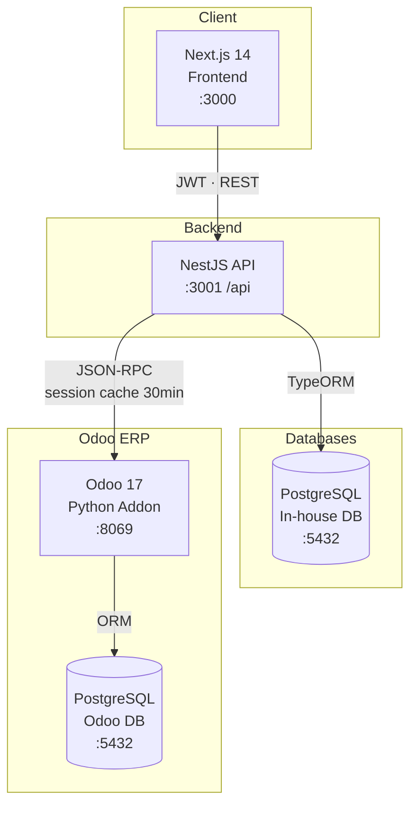
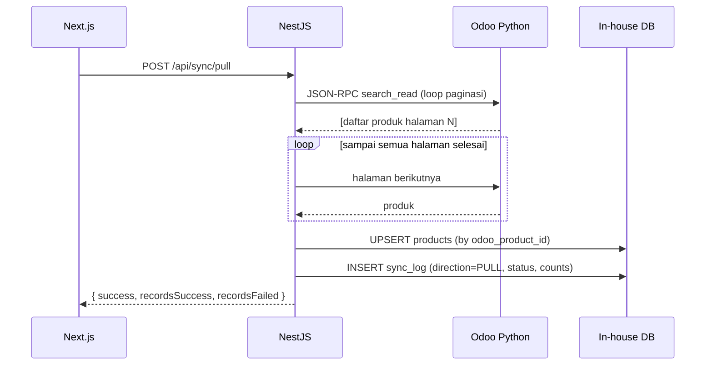
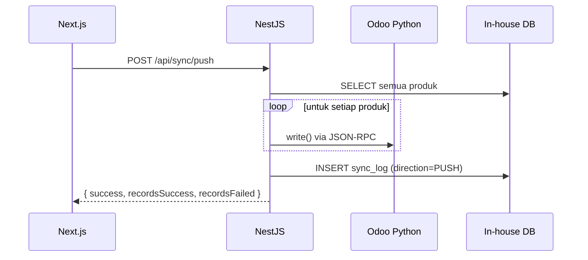

# Arsitektur — Warehouse System Multi Power

## Gambaran Sistem

Sistem ini menjembatani Odoo 17 ERP yang sudah ada dengan aplikasi web warehouse in-house yang dibuat khusus. Odoo adalah **single source of truth** untuk data master produk; sistem in-house menambahkan CRUD, operasi massal, dan antarmuka yang lebih kaya.

---

## Arsitektur High-Level



---

## Rincian Service

| Service | Teknologi | Port | Tanggung Jawab |
|---------|-----------|------|----------------|
| `warehouse_frontend` | Next.js 14 + Tailwind | 3000 | UI — produk, sync, bulk update, dashboard |
| `warehouse_backend` | NestJS + TypeORM | 3001 | REST API, JWT auth, orkestrasi sync |
| `app_db` | PostgreSQL 15 | 5432 | Produk in-house, sync logs, users |
| `odoo_app` | Odoo 17 + Python | 8069 | Sumber data ERP, custom REST addon |
| `odoo_db` | PostgreSQL 15 | 5432 | Data internal Odoo |

---

## Alur Data

### Pull (Odoo → In-house)



### Push (In-house → Odoo)



---

## Struktur Module (NestJS)

```
backend/src/
├── auth/                  # JWT login, guard, user entity
├── products/              # CRUD, bulk-update, product entity + repository
├── sync/                  # Orkestrasi pull/push, sync-log entity
├── odoo-integration/      # OdooClientService (session cache), OdooProductService
├── common/
│   ├── dto/               # PaginationQueryDto
│   ├── filters/           # HttpExceptionFilter
│   ├── guards/            # JwtAuthGuard
│   └── interceptors/      # TransformInterceptor
├── config/                # database.config.ts
└── database/migrations/   # File migrasi TypeORM
```

---

## Struktur Odoo Addon

```
odoo/addons/custom_inventory/
├── models/
│   └── product_template.py   # _inherit product.template, field kustom, get_warehouse_data()
├── services/
│   └── product_service.py    # Business logic (search, create, update, bulk_update)
├── controllers/
│   └── product_api.py        # HTTP routes — didelegasikan ke ProductService
└── __manifest__.py
```

---

## Keputusan Desain Utama

### 1. Odoo Session Caching
`OdooClientService` melakukan autentikasi sekali dan menyimpan session cookie + UID selama **30 menit**. Request berikutnya menggunakan session yang sudah di-cache, sehingga menghindari overhead auth per-request dan rate limit login Odoo.

### 2. Paginasi dengan `pageSize`
Semua endpoint list menggunakan `pageSize` (bukan `limit`) secara konsisten di NestJS maupun Odoo Python addon, sesuai requirement yang ditentukan.

### 3. Strategi Upsert
Saat sync pull, produk dicocokkan berdasarkan `odoo_product_id` (bukan `part_number`) agar perubahan nama produk tetap tertangani dengan benar. Produk baru di-insert; produk yang sudah ada di-update secara in-place.

### 4. Repository Pattern
`ProductRepository` membungkus injectable repository milik TypeORM, mengisolasi semua query SQL dari business logic. `ProductsService` hanya berinteraksi dengan `ProductRepository`, sehingga service tetap bisa di-test tanpa database sungguhan.

### 5. Middleware Global NestJS
- `ValidationPipe` — membuang field yang tidak dikenal, mentransformasi tipe data, memvalidasi DTO
- `TransformInterceptor` — membungkus semua response dalam format `{ success, data, message }`
- `HttpExceptionFilter` — memetakan exception NestJS ke error payload yang konsisten
- `ThrottlerGuard` — 60 req/menit secara global; 5 req/15 menit khusus endpoint login
